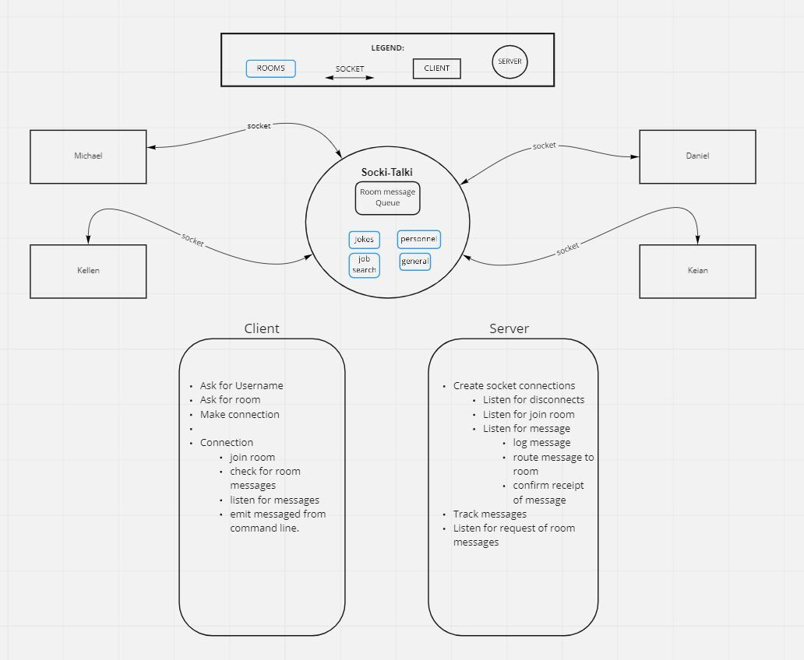
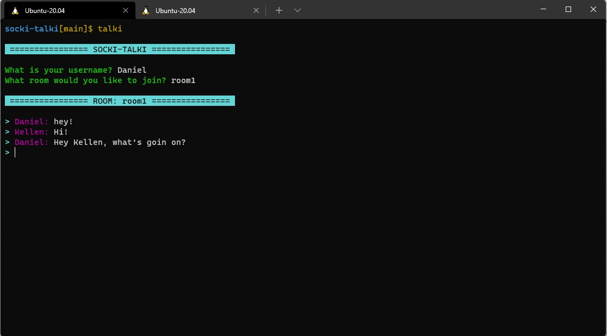
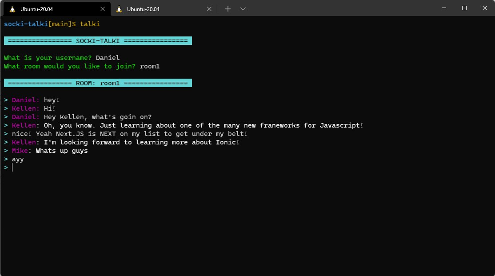

# socki-talki

socki-talki deployed on Heroku.

Deployment URL: https://socket-talki.herokuapp.com

## Installation

to install run `git clone git@github.com:socki-talki/socki-talki.git`

run `npm install`

To set up the command line shortcut, follow these steps:
  1. In the terminal, navigate to the root directory of the project.
  2. Once in root dir, type `npm install -g`.
  3. Once package is installed globally, type `talki` in any directory to run the `clients/clients.js` file and communicate with our server!

## Usage

To start server run: `npm start`

To test server run: `npm test`

## Routes

This application is using web-sockets, and there is no webpage related to this application. Instead, you could clone the repo and then go ahead and use 'npm install -g'. Then type 'talki' into the CLI and get chatting!

## Features

* Room:
  * Select what room you want to start chatting, or just enter nothing to enter public chat.

* Messages:
  * Messages are passed through `socket.io` and instantly displayed on other users' terminals.
  * Previous messages from the last day are saved to the server and displayed when entering a room so you're never left out of the conversation.

* Style:
  * Used `colors.JS` to add the terminal coloring.
  * There are five easy to read color scheme that users will randomly receive upon logging in.

* Username:
  * Ability to create your own username without worry of it already being taken.

## Socki-Talki in Action!

  

    
Load previous messages upon joining room!

    
  

  

    
Let all your friends know so they can join in!

    
  

 

 

## Created by:

- **Kellen Linse:** https://github.com/Kellen-Linse
- **Daniel Jackson:** https://github.com/daniel-jacks
- **Keian Anthony:** https://github.com/Keian-A
- **Micheal Metcalf:** https://github.com/Metty82